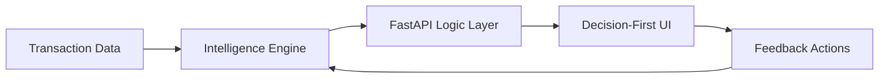
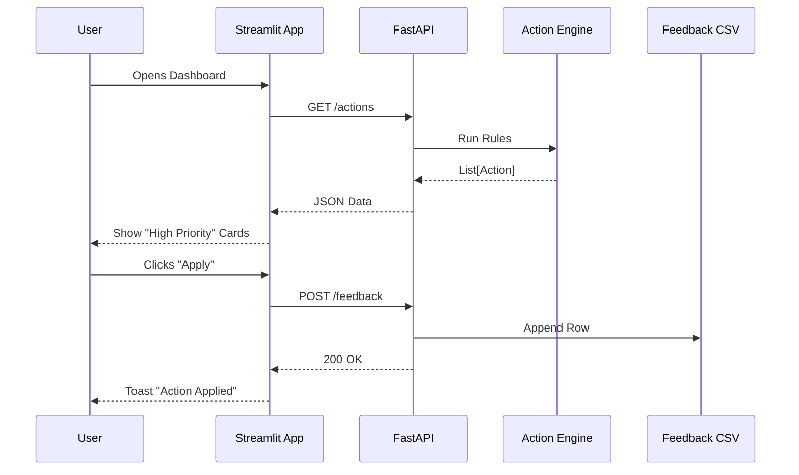

# Behavior Intelligence Decision System — System Architecture

> **Current Architecture Status**: A rules-based decision support system for customer retention and growth.
> **Philosophy**: Decision-First, No Black-Box ML.

---

## High-Level Architecture

The system follows a strict **unidirectional data flow** pipeline, transforming raw transactions into actionable decisions.



---

## 2. Core Layers & Components

### Layer 1: Data & Input
**Location**: `data/`
- **Transactions (`data/raw/`):** The source of truth. Schema: `customer_id`, `date`, `amount`.
- **Feedback (`data/feedback.csv`):** The system's memory. Records every human decision (Apply/Ignore) made on recommendations.

### Layer 2: Feature & Segmentation Engine
**Location**: `features/`, `segmentation/`
- **RFM Engine (`features/rfm.py`):** 
    - Computes **R**ecency, **F**requency, **M**onetary values.
    - Assigns **1-5 scores** (Quintiles) for each dimension.
    - Calculates composite **RFM Score** (`0.3R + 0.3F + 0.4M`).
- **Segmentation Logic (`segmentation/rfm_segments.py`):**
    - Deterministic, rules-based mapping:
    - `Champions`: R=4-5, F=4-5
    - `At Risk`: R=1-2, F=3-5
    - (And 3 other segments)

### Layer 3: Action Engine
**Location**: `actions/`
- **Rule Engine (`actions/action_engine.py`):**
    - The "Brain" of the system.
    - **Input**: Segment + RFM Scores.
    - **Logic**: IF `Segment == At Risk` AND `Money >= 4` THEN `Offer Retention`.
    - **Output**: Action Cards with Priority (High, Medium, Low).

### Layer 4: Intelligence & Drift
**Location**: `drift/`
- **Drift Detector (`drift/segment_drift.py`):**
    - Monitors stability.
    - Compares execution-time segment distribution vs previous snapshots.
    - Alerts on significant shifts (e.g., "At Risk segment grew by 5%").

### Layer 5: Delivery & Interaction
**Location**: `api.py`, `app.py`
- **API (`api.py`):** Single-file FastAPI exposing logic as JSON services.
    - `GET /actions`: The "feed" of recommendations.
    - `POST /feedback`: The write-back for decisions.
- **UI (`app.py`):** Streamlit interface optimized for speed.
    - **Zero-Config Dashboard**: Prioritizes "What do I do now?" over "What happened?".

---

## 3. End-to-End Data Flow

### The "Decision Loop"

1. **Ingest**: `api.py` loads `demo_transactions.csv`.
2. **Compute**: 
   - `rfm.py` transforms 2000 rows → 500 Customer Profiles.
   - `rfm_segments.py` labels them (e.g., "C001 is At Risk").
3. **Reason**:
   - `action_engine.py` scans profiles against Business Rules.
   - Finds C001 matches "High Value Churn Risk" rule.
   - Generates Action Object: `{id: "act_retention_001", priority: "High"}`.
4. **Serve**: UI fetches Action Object via `GET /actions`.
5. **Act**: User clicks "✅ Apply". UI posts to `/feedback`.
6. **Learn**: System saves decision to `feedback.csv` (for future audit/optimization).

### Sequence Diagram



---

## 4. Key Features Implemented

| Feature category | Capability | Implementation details |
|------------------|------------|------------------------|
| **Scoring** | 1-5 Scale | Quintile-based dynamic scoring on R, F, M. |
| **Segmentation** | 5 Core Segments | Champions, Loyal, Potential Loyalists, At Risk, Hibernating. |
| **Decisioning** | Priority Queuing | Actions are sorted by Business Priority (High > Med > Low). |
| **Drift** | Stability Check | Real-time calculation of segment distribution shifts. |
| **Feedback** | Human-in-the-loop | All rejected/accepted actions are logged with timestamps. |
| **Explainability** | "Glass Box" | Every action includes a natural language "Reason" field. |

---

## 5. Directory Structure Map

```text
customer-analytics/
├── api.py                  # API Gateway
├── app.py                  # UI Frontend
├── features/
│   └── rfm.py              # Math Logic
├── segmentation/
│   └── rfm_segments.py     # Business Logic (Classification)
├── actions/
│   └── action_engine.py    # Business Logic (Recommendation)
├── drift/
│   └── segment_drift.py    # Monitoring Logic
├── data/
│   └── feedback.csv        # Persistence
└── scripts/
    └── generate_demo_data.py
```
